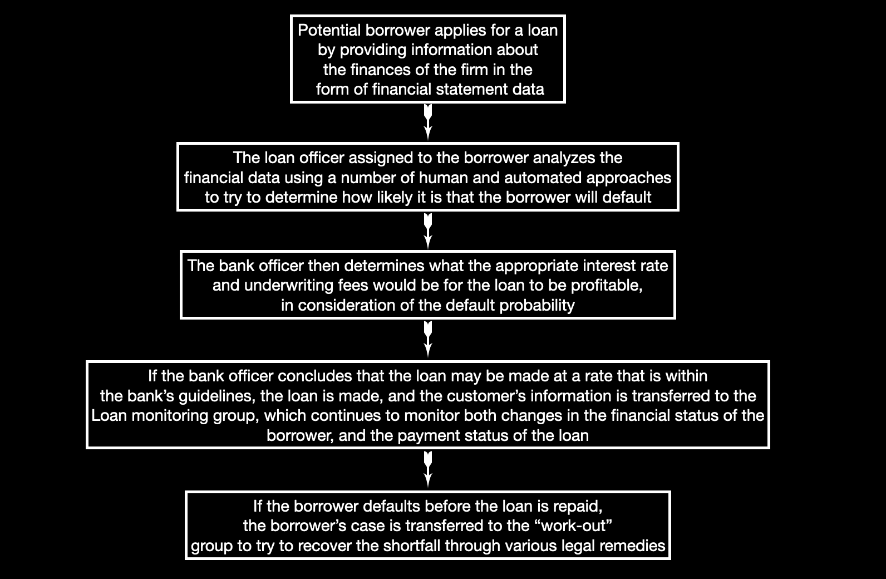

#  Improving Loan Underwriting at Banca Massiccia

##  Business Case Definition

 
Banca Massiccia, a large Italian bank, has been making loans to businesses for many years, and has experimented with different approaches to underwrite these loans, including statistical models of default. Their vision is to use risk-based pricing to set interest rates and underwrite fees for borrowers. However, this vision comes with understandable obstacles, such as how to optimize its underwriting process using the power of machine learning so that the bank can produce the probability of default (PD) for prospective borrowers both efficiently and accurately, as well as set the price and interest rates based on heterogeneous risks. Banca Massiccia would like to leverage the data it has accumulated over the past several years and better predict the probability that a potential borrower will default on a principal or interest payment for a prospective loan over the next 12 months. In this proposal, we outline a project in which we will develop a state-of-the-art machine learning algorithm for Banca Massiccia, which will employ innovative approaches to understanding Banca Massiccia's clients and making PD predictions based on client features.

The basics of a transaction flow is as follows:

##  Dataset Overview
|Variable Name | Description|
| ------------ | ---------- |
|id            | firm identifier|
|HQ_cities | city of the main branch|
|legal_struct| legal structure|
|ateco_sector| industry sector code|
|fs_year| year of the financial statement|
|asst_intang_fixed| intangible assets|
|asst_tang_fixed| tangible assets|
|asst_fixed_fin|financial assets|
|asst_current|current assets|
|AR|account receivable|
|cash_and_equiv|cash & equivalent holdings|
|asst_tot| total assets|
|eqyt_tot|total equity|
|eqyt_corp_family_tot|total equity for entire group ("family")|
|liab_lt|long-term liabilities|
|liab_lt_emp|long-term liab to employees|
|debt_bank_st|short-term bank debt|
|debt_bank_lt|long-term bank debt|
|debt_fin_st|short-term debt other|
|debt_fin_lt|long-term debt other|
|AP_st|short-term accounts payable|
|AP_lt|long-term accounts payable|
|debt_st|short-term debt|
|debt_lt|long-term debt|
|rev_operations|operating revenue|
|COGS|cost of goods sold|
|prof_operating|operating profit|
|goodwill| goodwill|
|inc_financing|financial income|
|exp_financing|financial expense|
|prof_financing|financial profit|
|inc_extrard|extraordinary income|
|taxes|taxes|
|profit|net profit|
|days_rec|days receivable|
|ebitda|earnings before interest, taxes, depreciation, and amortization|
|roa|return on assets|
|roe|return on equity|
|wc_net|net working capital|
|margin_fin|equity - fixed assets|
|cf_operations|operating cashflow|

##  Project Description

This project is aimed at helping Banca Massiccia better predict the probability of default based on a client's features. We will focus on two main objectives:
<ol>
    <li> Exploratory analysis of borrower segments
    <li> Development of a machine learning algorithm for predicting probability of default (PD)
</ol>
We feel that these two branches of the project will combine to give Banca Massiccia a better understanding of their customers' financial behaviors and performances and will allow them to deliver a more personalized pricing strategy.

In objective 1, Borrower Insights, we will perform a borrower segmentation analysis on data provided by Banca Massiccia. We will first perform an in-depth analysis of the borrower's data in which we will assess data quality and completeness, before performing preliminary exploratory analyses, looking for relationships between financial behavior, performance features (e.g., equity, debt, and profit) and default behavior (e.g., default date). We will then select a subset of features that have the most utility for separating borrowers into default and non-default segments. To achieve this we will take an unsupervised approach, exploring several clustering methodologies before determining which has the most promise for this particular dataset. Notice that when performing cluster analysis, the number of clusters should be set as 2 (e.g., default vs. non-default, if the default happens within 12 months after the financial statement date then the borrower is defined as default, otherwise defined as non-default).

In objective 2, Probability of Default (PD) Prediction, we will focus on building a SOTA machine learning algorithm that can be used to predict borrowers' probability of default on principal and interest payments over the following 12 months. We plan to use a neural network model in a supervised setting, in combination with the borrower feature subsets and default variables identified in Objective 1. However, through the course of our research for this project we may find that a different approach may be more appropriate. We have, therefore, broken this project into two discrete phases: research and building. The research phase will involve exploring various loan default prediction methods, with the intention to gain enough knowledge to choose a single best option for the build phase, where we will productionise an algorithm that runs on the borrowers' features and returns the probability of default. 

We outline the plan for this project below.

|
Project Proposal: Borrower Insights and Default Prediction
|
|-----------------------------------------------------------|
| *Objective: This project is aimed at developing a machine learning algorithm that predict the probability of default on a principal or interest payments for a prospective loan over the next 12 months*|

-- **Objective 1 : Borrower Insights**
| Milestone | Work Carried Out|Outcome/Deliverables|Completion Date|
| --------  | --------  | --------  | --------  | 
| Milestone1 |<li> **Exploratory Analysis** <li> We will explore the data available to support the project.<li> We will perform a preliminary analysis with a goal of identifying a subset of features that are best-suited for cluster analysis in Milestone 2.|<li> A report showing the initial findings of relationships between features. <li> A list of features to use for clustering.| End of Week 5|
|Milestone2| <li> **Cluster Analysis** <li> Using the learnings from Milestone 1, we will experiment with various clustering algorithms. <li> The best candidates will be selected for further improvements. |<li> A Github repository containing python code driving a segmentation model. <li> A report highlighting findings. | End of Week 6|

-- **Objective 2: PD Prediction**
| Milestone | Work Carried Out|Outcome/Deliverables|Completion Date|
| --------  | --------  | --------  | --------  | 
|Milestone3| <li>**Research** <li> Examine the data available to identify a feature space to use.|<li> A report showing initial findings of possible approaches to the PD prediction| End of Week 7|
|Milestone4| <li>**Build & Evaluate** <li> We will focus on building a neural network model for predicting borrower's probability of default, and training it on the existing dataset. <li> Evaluate the model performance with various metrics (e.g., precision, recall, roc, etc.)|<li> Deployed machine learning algorithms that trained on borrower features. <li> A demonstration outlining experimental approach and deployment specifications. <li> A Github repo containing all code used. |End of Week 8|